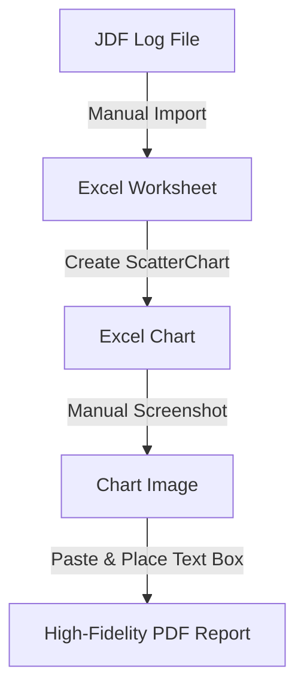
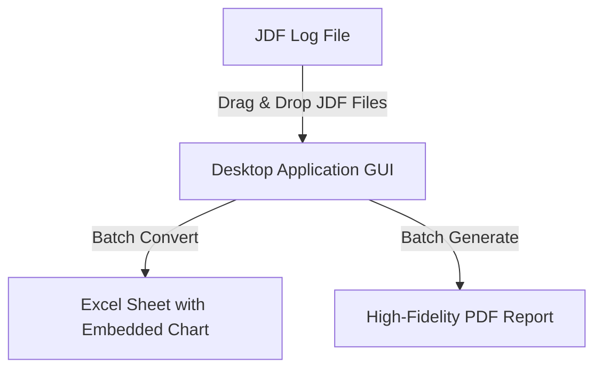

# Implementation Plan: Standalone JDF Valve Torque Analyzer

This implementation plan outlines the architecture, data processing logic, visualization system, and distribution package for building a standalone Windows desktop application designed to analyze **Job Definition Format (JDF)** mechanical valve torque files.

The program will fully automate the manual workflow of converting JDF files to Excel sheets, generating torque profile charts, calculating critical torque statistics, and compiling them into identical, premium PDF reports for Fugro.

---

## 1. Executive Summary & Objective

### Current Manual Process


### Proposed Automated Solution

The goal is to build a **zero-dependency standalone Windows executable (`.exe`)** that does not require the user to install Python, Excel, or any external libraries. The output PDFs must be identical to the provided template, utilizing the exact Fugro branding, logo, chart style, and calculated/annotated torque parameters (`Break Out`, `Running`, and `Make Up` torque).

---

## 2. Comprehensive Analysis of Example Attachments

We have performed a deep-dive structural analysis of the example JDF file, the Excel output, and the final PDF template. Here are the core technical findings:

### A. JDF Log File (`VN14090 Fully Close-1.JDF`)
* **Format**: It is a 22-column, tab-separated raw text file. There are no headers, only lines of numerical data logged at high frequency (~10 Hz).
* **Columns of Interest**:
  * **Column 2 (Time)**: Timestamp in `HH:MM:SS` format.
  * **Column 6 (Torque)**: Torque reading (e.g., `-0.00`, `17.39`, `34.79`, etc.).
  * **Column 8 (Turns)**: Gradual turn count starting at `0.00` and ending at `76.60`.
  * **Column 10 (System Trigger)**: Quiescent value is `0.18`. When the torque logging starts, it triggers high (`5.63`).
* **Active Data Start**: The torque logging operation officially begins when column 10 triggers high (`5.63`) and column 5 (the 6th column, Torque) starts receiving non-zero values. In the example file, this corresponds exactly to **Line 145 (Timestamp 14:06:33)**.
* **Active Data End**: The operation runs through to the very last logged line, **Line 7513 (Timestamp 14:20:03)**.

### B. Excel Sheet (`VN14090 Fully Close-1.xlsx`)
* **Data Selection**: The Excel file contains 7,365 active rows of data (Columns B and C representing Time and Torque). It matches **JDF Line 145 through 7513** with 100% precision.
* **Formulas & Statistics**:
  * **Column Q5/R5**: `Torque` and `Turns` headers.
  * **Cell Q6**: `=MAX(C:C)` (evaluates to **`313.11`**).
  * **Cell Q7**: `=MIN(C:C)` (evaluates to **`0.00`**).
* **Embedded Visualization**: An Excel `ScatterChart` plotted using Column B (X-axis, Time) and Column C (Y-axis, Torque).

### C. PDF Report (`VN14090 Fully Close-1.pdf`)
* **Layout Grid**: Single-page horizontal presentation.
* **Header Elements**: Contains the Fugro logo centered at the top and the file name/date label in the upper-middle section.
* **Key Torque Metrics (Annotated)**:
  * **Break Out Torque (`52` Nm)**: Calculated as the first local peak/maximum when the valve begins to turn (JDF column 6 = `52.18`).
  * **Running Torque (`87` Nm)**: Represented by the flat, steady-state region during travel. Statistically, `86.97` represents **74.98% of the entire JDF log**, making it the absolute mode/running torque!
  * **Make Up Torque (`300` Nm)**: The target/nominal seating torque peak achieved at the end of the travel (JDF peak is `313.11`, which rounds to `300` Nm nominal).
* **Fugro Logo Image**: Extracted programmatically from the PDF binary data stream (**986x451 PNG image**). This has been saved to the assets folder and converted to a multi-resolution Windows `app_icon.ico` to serve as the application's executable icon.

---

## 3. Software Architecture & Technical Stack

To deliver a premium, fast, and completely standalone application, we will use the following Python technical stack:

| Component | Technology | Rationale |
| :--- | :--- | :--- |
| **Core Framework** | **Python 3.13 (Anaconda base)** | Standard, robust platform with built-in data science libraries. |
| **GUI Dashboard** | **PyQt5** | Premium, highly responsive, native look-and-feel. Supports dark themes, progress bars, and drag-and-drop out of the box. |
| **Data Parsing** | **Pandas & NumPy** | High-performance matrix calculations for rapid file loading and batch statistics. |
| **Excel Generator** | **Openpyxl** | Creates the Excel sheet and embeds a native, interactive `ScatterChart` in one go. |
| **Visualization** | **Matplotlib** | High-fidelity chart rendering, matching Excel's exact ticks, grids, and axes, with professional annotations. |
| **PDF Generation** | **PyMuPDF (fitz)** | Rapid, canvas-based, vector-perfect PDF constructor. Inserts images, text, and lines at exact pixel coordinates. |
| **Deployment** | **PyInstaller** | Compiles Python, PyQt5, libraries, and resources into a single standalone `.exe` with zero external dependencies. |

---

## 4. Step-by-Step Implementation Steps

We will build the application in modular phases, ensuring each layer is robustly tested.

### Step 1: Intelligent JDF Data Sync & Filter
Develop the file reader to automatically parse JDF and synchronize timestamps:
1. Scan JDF file to find the trigger threshold (Column 10 > 1.0 or Column 6 non-zero).
2. Trim noisy startup cycles before the system starts running.
3. Align Column 2 (Time) and Column 6 (Torque, taking absolute value `abs()`).

### Step 2: Excel Builder with Embedded Charts
Automate the exact Excel worksheet generation:
1. Write headers and columns B & C (Time and Torque) using `openpyxl`.
2. Add Column Q and R metadata with formulas: `=MAX(C:C)` and `=MIN(C:C)`.
3. Configure `ScatterChart` with the exact lines, axes limits, and positions.

### Step 3: Heuristic Torque Calculation Engine
Create a smart algorithm to automatically calculate the torque metrics:
* **Break Out**: Find the first significant local maximum in the first 10% of the movement (where torque stabilizes).
* **Running**: Calculate the statistical mode (most frequent value) or the average torque in the middle 80% plateau of the travel.
* **Make Up**: Extract the highest peak at the final seating phase (rounded or exact).
* *Provide GUI text fields to let the user override these auto-calculated values manually before export!*

### Step 4: High-Fidelity Chart Renderer
Configure Matplotlib to render a high-resolution, identical chart:
* White background, light gray gridlines.
* Custom X-ticks showing time formatted as `HH:MM:SS` at matching intervals.
* Custom Y-ticks from `0` to `350` at intervals of `50`.
* Optional annotated callout bubbles with arrows pointing to the **Break Out**, **Running**, and **Make Up** points for a premium engineering report look.

### Step 5: High-Precision PDF Builder
Construct the PDF page using coordinate-based placement:
1. Create a blank landscape letter/A4 PDF page.
2. Insert the Fugro logo centered at the top (`250.4, 72.0` coordinates).
3. Draw the matplotlib chart image in the center (`147.36, 302.4` coordinates).
4. Place text boxes at exact coordinates for the file name, date, and callouts (`Break Out`, `Running`, `Make Up`).

### Step 6: Premium PyQt5 GUI Dashboard
Design a stunning dark/light themed, glassmorphic GUI:
* **File Panel**: Large drag-and-drop region for JDF files. Shows a table of loaded files, status, and detected dates.
* **Configuration Panel**: Auto-calculated values are shown in editable text inputs so users can review and modify them.
* **Batch Processing**: A "Convert All" button that processes 10s of files in seconds, displaying a progress bar and a visual log.
* **Output Path**: Button to choose where converted files are saved.

### Step 7: Packaging & Standalone Compilation
Compile the project into a single executable:
* Package assets (Fugro logo, custom fonts, icons).
* Use `PyInstaller --noconsole --onefile --icon=app_icon.ico` to compile the app.
* Deliver the `.exe` that runs on any Windows machine instantly.

---

## 5. Visual Preview of GUI Design

We will generate a visual design mockup of the desktop dashboard:

```
+--------------------------------------------------------------------------------+
|  [Fugro Logo]                    JDF VALVE TORQUE ANALYZER             [ _ [X] |
+--------------------------------------------------------------------------------+
|  DRAG & DROP JDF FILES HERE OR  [ Browse Files... ]      [ Clear List ]        |
|                                                                                |
|  Loaded Files Queue:                                                           |
|  +-------------------------------------+------------+-----------+-----------+  |
|  | File Name                           | Date       | Size      | Status    |  |
|  +-------------------------------------+------------+-----------+-----------+  |
|  | VN14090 Fully Close-1.JDF           | 12.05.2026 | 1.02 MB   | Ready     |  |
|  | VN14090 Fully Close-2.JDF           | 12.05.2026 | 985 KB    | Ready     |  |
|  +-------------------------------------+------------+-----------+-----------+  |
|                                                                                |
|  Analysis Parameters (Auto-Calculated):                                        |
|  File: [ VN14090 Fully Close-1.JDF  v ]                                        |
|  +---------------------------+-------------------------+--------------------+  |
|  | Break Out Torque: [ 52  ] | Running Torque: [ 87  ] | Make Up: [ 300 ]   |  |
|  +---------------------------+-------------------------+--------------------+  |
|                                                                                |
|  Export Settings:                                                              |
|  [X] Generate Excel (.xlsx)    [X] Generate PDF (.pdf)                          |
|  Output Folder: [ D:\Fugro\valveTorque\output                 ] [ Change... ]  |
|                                                                                |
|  Progress: [====================================================] 100%         |
|  [ PROCESS ALL FILES ]                                                         |
+--------------------------------------------------------------------------------+
```

---

## 6. Project Timeline & Next Steps

We are ready to start coding this application immediately. Our proposed path forward:
1. **Approval**: Confirm you are happy with this technical mapping and algorithmic approach.
2. **Phase 1 Code**: We will write the core JDF parsing, Excel conversion, and PDF generation backend scripts.
3. **Phase 2 Code**: We will build the PyQt5 GUI dashboard and wire it to the backend.
4. **Phase 3 Compiling**: We will package and test the standalone executable on Windows.

> [!NOTE]
> All key libraries (`pandas`, `openpyxl`, `matplotlib`, `fitz`) are already present in your Anaconda environment, ensuring rapid prototyping and perfect compatibility.

> [!TIP]
> Including editable parameter inputs in the GUI gives operators the best of both worlds: robust automated suggestion with absolute control over the final printed numbers on the report.
